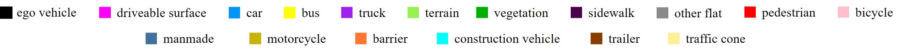
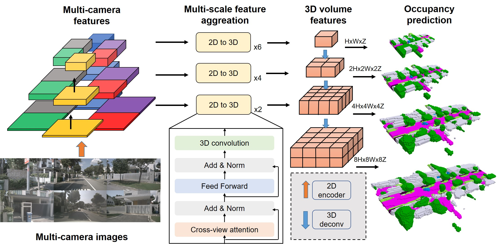

# SurroundOcc
### [Project Page](https://weiyithu.github.io/SurroundOcc/) | [Paper](https://arxiv.org/abs/2303.09551) | [Video](https://cloud.tsinghua.edu.cn/d/97b74c039b8d4fd48830/) | [Data](https://cloud.tsinghua.edu.cn/d/8dcb547238144d08a0bb/)
<br/>

> SurroundOcc: Multi-Camera 3D Occupancy Prediction for Autonomous Driving  
> [Yi Wei*](https://weiyithu.github.io/), [Linqing Zhao*](https://github.com/lqzhao), [Wenzhao Zheng](https://scholar.google.com/citations?user=LdK9scgAAAAJ&hl=en), [Zheng Zhu](http://www.zhengzhu.net/), [Jiwen Lu](http://ivg.au.tsinghua.edu.cn/Jiwen_Lu/), [Jie Zhou](https://scholar.google.com/citations?user=6a79aPwAAAAJ&hl=en&authuser=1)  

## News
- [2022/7/14]: SurroundOcc is accepted to ICCV 2023! 
- [2022/5/19]: We upload generated mesh vertices. You can downsample it and generate occupancy labels with arbitrary resolution.  
- [2022/3/21]: Support for private data. You can try both occupancy prediction method and ground truth generation pipeline on your own data. 
- [2022/3/17]: Initial code and paper release. 
- [2022/2/27]: Demo release.

## Demo  
Demos are a little bit large; please wait a moment to load them. If you cannot load them or feel them blurry, you can click the hyperlink of each demo for the full-resolution raw video. Welcome to the home page for more demos and detailed introductions. 

### [Occupancy prediction:](https://cloud.tsinghua.edu.cn/f/f7768f1f110c414297cc/)

<p align='center'>


</p>

### [Generated dense occupancy labels:](https://cloud.tsinghua.edu.cn/f/65d91a4c891f447da731/)
<p align='center'>

</p>


## Introduction
Towards a more comprehensive and consistent scene reconstruction, in this paper, we propose a SurroundOcc method to predict the volumetric occupancy with multi-camera images. We first extract multi-scale features for each image and adopt spatial cross attention to lift them to the 3D volume space. Then we apply 3D convolutions to progressively upsample the volume features and impose supervision on multiple levels. To train the multi-camera 3D scene reconstruction model, we design a pipeline to generate dense occupancy ground truth with sparse LiDAR points. The generation pipeline only needs existed 3D detection and 3D semantic segmentation labels without extra human annotations. Specifically, we fuse multi-frame LiDAR points of dynamic objects and static scenes separately. Then we adopt Poisson Reconstruction to fill the holes and voxelize the mesh to get dense volumetric occupancy.

## Method 

Method Pipeline:

<p align='center'>

</p>

Occupancy Ground Truth Generation Pipeline:

<p align='center'>

</p>

## Getting Started
- [Installation](docs/install.md) 
- [Prepare Dataset](docs/data.md)
- [Train, Eval and Visualize](docs/run.md)

You can download our pretrained model for [3D semantic occupancy prediction](https://cloud.tsinghua.edu.cn/f/7b2887a8fe3f472c8566/?dl=1) and [3D scene reconstruction tasks](https://cloud.tsinghua.edu.cn/f/ca595f31c8bd4ec49cf7/?dl=1). The difference is whether use semantic labels to train the model. The models are trained on 8 RTX 3090s with about 2.5 days.  

## Try your own data
### Occupancy prediction
You can try our nuScenes [pretrained model](https://cloud.tsinghua.edu.cn/f/7b2887a8fe3f472c8566/?dl=1) on your own data!  Here we give a template in-the-wild [data](https://cloud.tsinghua.edu.cn/f/48bd4b3e88f64ed7b76b/?dl=1) and [pickle file](https://cloud.tsinghua.edu.cn/f/5c710efd78854c529705/?dl=1). You should place it in ./data and change the corresponding infos. Specifically, you need to change the 'lidar2img', 'intrinsic' and 'data_path' as the extrinsic matrix, intrinsic matrix and path of your multi-camera images. Note that the order of frames should be same to their timestamps. 'occ_path' in this pickle file indicates the save path and you will get raw results (.npy) and point coulds (.ply) in './visual_dir' for further visualization. You can use meshlab to directly visualize .ply files. Or you can run tools/visual.py to visualize .npy files. 
```
./tools/dist_inference.sh ./projects/configs/surroundocc/surroundocc_inference.py ./path/to/ckpts.pth 8
```

### Ground truth generation
You can also generate dense occupancy labels with your own data! We provide a highly extensible code to achieve [this](https://github.com/weiyithu/SurroundOcc/blob/main/tools/generate_occupancy_with_own_data/process_your_own_data.py). We provide an example [sequence](https://cloud.tsinghua.edu.cn/f/94fea6c8be4448168667/?dl=1) and you need to prepare your data like this:

```
your_own_data_folder/
├── pc/
│   ├── pc0.npy
│   ├── pc1.npy
│   ├── ...
├── bbox/
│   ├── bbox0.npy (bounding box of the object)
│   ├── bbox1.npy
│   ├── ...
│   ├── object_category0.npy (semantic category of the object)
│   ├── object_category1.npy
│   ├── ...
│   ├── boxes_token0.npy (Unique bbox codes used to combine the same object in different frames)
│   ├── boxes_token1.npy
│   ├── ...
├── calib/
│   ├── lidar_calibrated_sensor0.npy
│   ├── lidar_calibrated_sensor1.npy
│   ├── ...
├── pose/
│   ├── lidar_ego_pose0.npy
│   ├── lidar_ego_pose1.npy
│   ├── ...
```
You can generate occupancy labels with or without semantics (via acitivating --with semantic). If your LiDAR is high-resolution, e.g. RS128, LiVOX and M1, you can skip Poisson reconstruction step and the generation processe will be very fast! You can change the point cloud range and voxel size in config.yaml. You can use multithreading to boost the generation process.
```
cd $Home/tools/generate_occupancy_nuscenes
python process_your_own_data.py --to_mesh --with_semantic --data_path $your_own_data_folder$ --len_sequence $frame number$
```
You can use --whole_scene_to_mesh to generate a complete static scene with all frames at one time, then add the moving object point cloud, and finally divide it into small scenes. In this way, we can accelerate the generation process and get denser but more uneven occupancy labels. 

## Acknowledgement
Many thanks to these excellent projects:
- [BEVFormer](https://github.com/fundamentalvision/BEVFormer)
- [MonoScene](https://github.com/astra-vision/MonoScene)

Related Projects:
- [TPVFormer](https://github.com/wzzheng/TPVFormer)
- [OpenOccupancy](https://github.com/JeffWang987/OpenOccupancy)

## Bibtex
If this work is helpful for your research, please consider citing the following BibTeX entry.

```
@article{wei2023surroundocc, 
      title={SurroundOcc: Multi-Camera 3D Occupancy Prediction for Autonomous Driving}, 
      author={Yi Wei and Linqing Zhao and Wenzhao Zheng and Zheng Zhu and Jie Zhou and Jiwen Lu},
      journal={arXiv preprint arXiv:2303.09551},
      year={2023}
}
```

